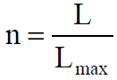

# A Survey of Tone Mapping Techniques
## 摘要
    本文给出了使用通用光照模型的色调映射技术的一个调查，比较了线性和非线性模型，并给出了每种方法的优缺点。
## 介绍
    显示设备的对比度通常不超过100，但计算出的对比度可能高达7000，同时人眼视觉系统（HVS）可以感受到10^10的对比度，但在同一时间我们只能处理几百的对比度。也就是人眼存在自适应功能。  
    需要注意的是，本文不讨论在空间上不统一的算法，也就是说所有相同值的像素将会被映射到相同的值，于其所在的位置无关。      
    同时本文假设显示设备经过校准，其具有线性响应。
## 线性比例系数
    这种方法的好处在于计算简单，速度快，应用场景广泛。  
    第一个方法是做一个线性映射。
  
