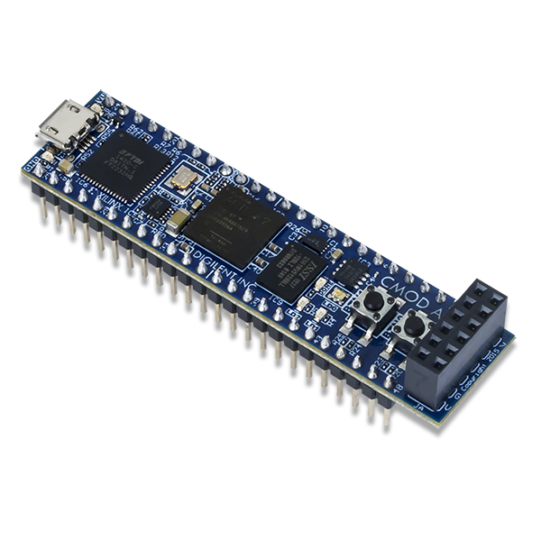

## Inverse tone mapping

### Introduction

由于HDR图像的大量出现，而传统设备只能支持SDR，所以如何将HDR转为SDR是一个非常重要的工作，即TMO（Tone Mapping Operator）。这些方法可以分为两类：

- 全局：对全局使用相同的映射函数、
- 局部：对每个像素点计算邻域的光照强度，然后根据其进行映射。最难的部分是如何正确确定邻域的大小，否则可能会出现振铃效应和光晕现象。

还有一类TMO试图模仿HVS来选择映射函数。

与Tone Mapping相对应的就是Inverse Tone Mapping（逆色调映射）。本文介绍了一种逆映射的方法。

